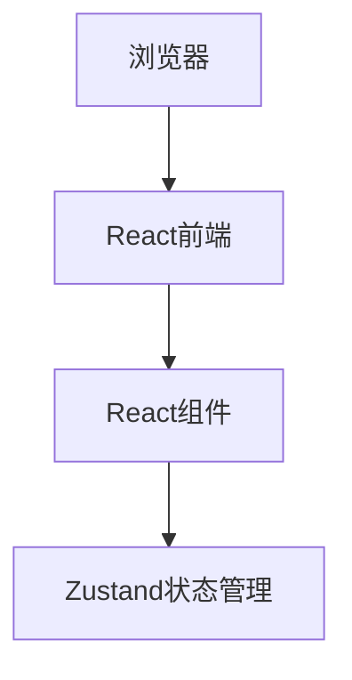

# 宠互助 - 技术架构文档

## 1. Architecture Design
采用纯前端架构，使用React + TypeScript + Tailwind CSS + Vite构建单页应用，通过本地状态管理数据。



## 2. Technology Description
- **Frontend**: React@18 + TypeScript + Tailwind CSS@3 + Vite
- **Initialization Tool**: vite-init
- **Backend**: 无（纯前端应用）
- **Database**: 本地状态存储（演示数据）
- **状态管理**: Zustand

## 3. Route Definitions
| Route | Purpose |
|-------|---------|
| / | 首页 |
| /exchange | 养宠交流 |
| /help | 养宠互助 |
| /events | 宠物活动 |
| /about | 关于我们 |

## 4. API Definitions (不适用，纯前端)

## 5. Server Architecture Diagram (不适用)

## 6. Data Model

### 6.1 数据结构定义

#### 交流内容
```typescript
interface ExchangePost {
  id: string;
  title: string;
  content: string;
  author: string;
  avatar: string;
  category: string;
  likes: number;
  comments: number;
  createdAt: Date;
  image?: string;
}
```

#### 互助请求
```typescript
interface HelpRequest {
  id: string;
  title: string;
  description: string;
  type: string;
  location: string;
  author: string;
  avatar: string;
  contact: string;
  urgency: number;
  status: string;
  createdAt: Date;
}
```

#### 活动
```typescript
interface Event {
  id: string;
  title: string;
  description: string;
  date: Date;
  location: string;
  image: string;
  maxParticipants: number;
  currentParticipants: number;
  organizer: string;
  status: string;
  createdAt: Date;
}
```
