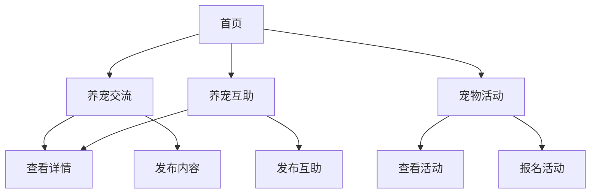

# 宠互助 - 宠物互助社区产品需求文档

## 1. Product Overview
宠互助是一个面向宠物爱好者的互助社区平台，为养宠人士提供交流分享、互助帮助和活动组织等功能，让每一位养宠人都能找到志同道合的朋友，获得专业的养宠建议和帮助。

- 主要功能：养宠交流、养宠互助、宠物活动三大核心模块

## 2. Core Features

### 2.1 User Roles
| Role | Registration Method | Core Permissions |
|------|---------------------|------------------|
| 普通用户 | 无需注册 | 浏览所有内容、发布交流、参与活动报名 |

### 2.2 Feature Module
1. **首页**：导航、英雄区、热门交流、精选互助、活动预告
2. **养宠交流**：交流列表、发布交流、查看详情
3. **养宠互助**：互助列表、发布互助、查看详情
4. **宠物活动**：活动列表、活动详情、报名活动
5. **关于我们**：平台介绍

### 2.3 Page Details
| Page Name | Module Name | Feature description |
|-----------|-------------|---------------------|
| 首页 | 导航栏 | Logo、导航菜单、搜索、响应式适配 |
| 首页 | 英雄区 | 温暖的欢迎语、柯基Logo、标语 |
| 首页 | 热门交流 | 展示最新热门的交流内容卡片 |
| 首页 | 精选互助 | 展示精选的互助请求卡片 |
| 首页 | 活动预告 | 展示即将开始的活动 |
| 养宠交流页 | 交流列表 | 支持筛选、搜索、卡片式展示 |
| 养宠交流页 | 发布交流 | 表单提交新的交流内容 |
| 养宠互助页 | 互助列表 | 展示各类互助请求 |
| 养宠互助页 | 发布互助 | 提交新的互助请求 |
| 宠物活动页 | 活动列表 | 展示各类宠物活动 |
| 宠物活动页 | 活动详情 | 查看活动信息、报名按钮 |

## 3. Core Process
用户打开网站 → 浏览首页内容 → 选择感兴趣的模块（交流/互助/活动）→ 查看详情或发布内容 → 参与互动。

## 4. User Interface Design

### 4.1 Design Style
- **主色调**：温暖的橙色 (#FF6B35)，温暖而友好，象征宠物的温暖感
- **辅助色**：温暖的米白色 (#FFF8E7)
- **按钮风格**：圆润饱满的圆角设计，温暖而友好
- **字体**：使用圆润友好的无衬线字体
- **布局风格**：卡片式布局，清晰美观
- **图标**：使用可爱的宠物相关图标
- **配色**：橙色+温暖色系为主，搭配柔和的渐变背景
- **动画**：适度的微交互动画，提升用户体验

### 4.2 Page Design Overview
| Page Name | Module Name | UI Elements |
|-----------|-------------|-------------|
| 首页 | 导航栏 | 固定顶部，响应式菜单，橙色品牌色 |
| 首页 | 英雄区 | 大号柯基Logo，温暖标语，暖色调渐变背景 |
| 首页 | 卡片区域 | 卡片式布局，带悬停效果，温暖配色 |
| 养宠交流 | 列表 | 网格布局，卡片，温暖配色 |
| 养宠互助 | 列表 | 网格布局，卡片，温暖配色 |
| 宠物活动 | 列表 | 网格布局，卡片，温暖配色 |

### 4.3 Responsiveness
- 响应式设计，支持手机端和桌面端完美适配
- 移动端优先，触摸友好
- 桌面端优化，交互流畅

### 4.4 3D Scene Guidance (不适用
